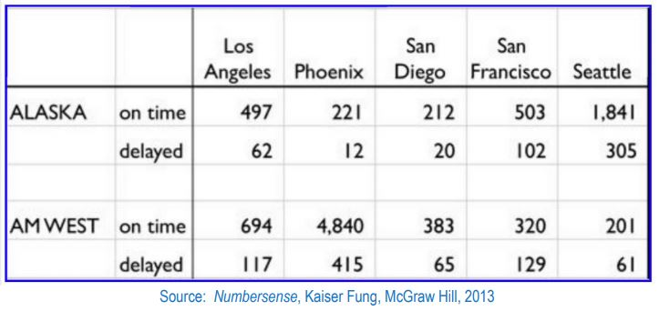

#Data 607: Tidying and transforming Data



The chart above describes arrival delays for two airlines across five destinations. Your task is to:

1. Create a .CSV file (or optionally, a MySQL database!) that includes all of the information above.
You’re encouraged to use a “wide” structure similar to how the information appears above, so
that you can practice tidying and transformations as described below.
2. Read the information from your .CSV file into R, and use tidyr and dplyr as needed to tidy
and transform your data.
3. Perform analysis to compare the arrival delays for the two airlines

### Import Libraries
```{r load-packages}
library(dplyr, warn.conflicts = F)
library(tidyr)
library(ggplot2)
library(reshape2)
```

### Loading the CSV

I copied the provided data to a csv and stored it on my github account.

```{r code-chunk-label}
flight_data <- read.csv("https://raw.githubusercontent.com/georg4re/DS607/master/data/flight-hw5-data.csv", stringsAsFactors = FALSE)
head(flight_data)
```

### Initial Data Cleanup
```{r}
flight_data <- flight_data %>%
  rename(airline = X, status = X.1) %>%
  fill(airline) %>%
  na.omit()
flight_data
```
### Transforming the Data

**Flights by Airline and city**
```{r}
flightsbyairline <- flight_data %>%
  gather("city", "Number", 3:7) %>%
  spread("status", "Number", 3:7) %>%
  rename(on_time='on time')

flightsbyairline
```
### Perform Calculations
Now, with the data "normalized" we want to perform some calculations.

```{r}

flightsbyairline <- flightsbyairline %>%
  mutate(flights = delayed + on_time, onTimeAvg = (on_time/flights)*100) %>%
  arrange(desc(onTimeAvg))
flightsbyairline
```
By calculating the Avg of on time flights and sorting the table from high to low average we can start to see that Alaska seems to have a better average per city than AMWest. Let's see it in a histogram:

```{r}
ggplot(flightsbyairline, aes(x = city, y = onTimeAvg, fill=airline)) + 
  geom_bar(stat="identity", position = position_dodge2())
```


### Flights per City
```{r}
flightsbycity2 <- flight_data %>%
  gather("city", "Number", 3:7) %>%
  spread("airline", "Number", 3:7) %>%
  mutate(flights = ALASKA + AMWEST) %>%
  select(-c(ALASKA, AMWEST)) %>%
  spread(status, flights) %>% 
  rename(on_time="on time") %>%
  mutate(flights = delayed + on_time, onTimeAvg = (on_time/flights)*100) %>%
  arrange(desc(onTimeAvg))
flightsbycity2
```
When we group the data by city, we can see that the city with the best on time average is Phoenix.
Let's compare all cities in a graph.

```{r}
ggplot(flightsbycity2, aes(x = reorder(city, -onTimeAvg), y = onTimeAvg, fill=city)) + 
  geom_bar(stat="identity", position = position_dodge2()) + 
  theme(axis.title.x = element_blank())
```

### Conclusions

Irrespective to Airline, Phoenix is the airport with the best average of on time flights and San Francisco has the worst average of the cities compared. Alaska does better than AMWEST in each of the cities compared.


...

